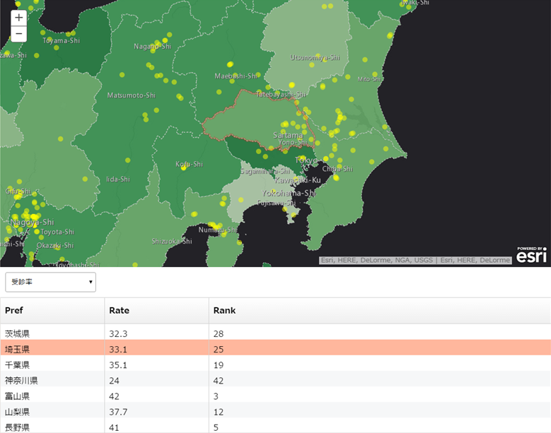
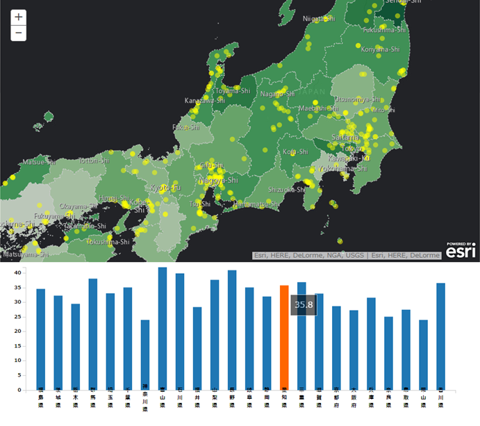

# esri-react-components-js

[ArcGIS API for JavaScript](https://developers.arcgis.com/javascript/) の Web アプリ開発に利用可能なモジュールとして [React](http://facebook.github.io/react/) で実装したコンポーネントを集約します。

[](http://badge.fury.io/bo/badges)

[README (English)](README_en.md)

## 利用方法

### パッケージのインストール

```
bower install esri-react-components-js
```

### Dojo AMD パッケージの定義

依存モジュールのパスを変えたい場合は `packages` の `location` を変更してください。

* examples/config/package.js

```javascript
  var dir_path = location.pathname.split("/").reverse().slice(3).reverse().join("/");

  var dojoConfig = {
    async: true,
    parseOnLoad: true,
    packages: [{
      name: 'react',
      location: dir_path + '/bower_components/react',
      main: 'react'
    }, {
      name: 'react-dom',
      location: dir_path + '/bower_components/react',
      main: 'react-dom'
    }, {
      name: 'fixedDataTable',
      location: dir_path + '/bower_components/fixed-data-table/dist',
      main: 'fixed-data-table'
    }, {
      name: 'reactWidgets',
      location: dir_path + '/src/esri-fixed-data-table/widget'
    }]
  };
```

## コンポーネント

* [__EsriFixedDataTable__](https://esrijapan.github.io/esri-react-components-js/examples/esri-fixed-data-table.html)



```javascript
var esriFixedDataTable = new EsriFixedDataTable({
  map: map, // esri.map or esri.arcgis.utils.createMap
  sources: [
    {
      layer: layer1, // esri.layers.FeatureLayer or esri.map.getLayer
      featureId: 'NAME', // ID Field
      attributes: [{ name: 'NAME', label: 'Name'}, { name: 'ADDRESS', label: 'Address'}, { name: 'TYPE', label: 'Type'}] // name: Field Name, label: Alias (using a header of table)
    },
    {
      layer: layer2,
      featureId: 'CITY_NAME',
      attributes: [{ name: 'CITY_NAME', label: 'City'}, { name: 'P_NUM', label: 'Population'}]
    }
  ],
  zoomLevel: 12 // Jumping to the level when selecting a row
}, 'tableDiv'); // <div> id of a table container
```

* [__EsriReactD3__](https://esrijapan.github.io/esri-react-components-js/examples/esri-react-d3-demo.html)



```javascript
var esriReactD3 = new EsriReactD3({
  map: map, // esri.map or esri.arcgis.utils.createMap
  chartType: 'BarChart', // 'BarChart' | 'PieChart' | 'AreaChart' | 'ScatterPlot' | 'LineChart'
  multipleSources: true // Chart views multiple data if true
  source: {
    layer: layer1, // esri.layers.FeatureLayer or esri.map.getLayer
    attributes: {
      x: { name: 'PREF', label: 'Pref' }, // Object when using single data
      y: [{ name: 'P_NUM_MALE', label: '男性人口' }, { name: 'P_NUM_FEMALE', label: '女性人口' }] // Array when using multiple data
    }
  },
  zoomLevel: 12 // Jumping to the level when selecting a data
}, 'chartDiv'); // <div> id of a chart container
```

## 使用している製品・プロジェクト

* [ArcGIS API for JavaScript](https://developers.arcgis.com/javascript/)
* [ArcGIS for Developers](https://developers.arcgis.com/en/)
* [React](https://facebook.github.io/react/)
* [Fixed Data Table](https://facebook.github.io/fixed-data-table/)
* [React D3 Components](https://github.com/codesuki/react-d3-components)
* [Babel](https://babeljs.io)

__ArcGIS の開発キットを使用して開発を行う場合は ArcGIS Online 開発者アカウント（[ArcGIS for Developers](https://developers.arcgis.com/en/)）が必要です。開発者アカウント作成ガイドは[こちら](http://www.esrij.com/cgi-bin/wp/wp-content/uploads/documents/signup-esri-developers.pdf)__

## 動作環境

* IE 9+
* Firefox
* Chrome
* Safari

## リソース

* [ArcGIS for Developers 開発者リソース](https://github.com/EsriJapan/arcgis-dev-resources)
* [GeoNet 開発者コミュニティ サイト](https://geonet.esri.com/groups/devcom-jp)
* [ArcGIS API for JavaScript（ESRIジャパン）](http://www.esrij.com/products/arcgis-api-for-javascript/)
* [ArcGIS API for JavaScript リファレンス](https://developers.arcgis.com/javascript/jsapi/)

## ライセンス
Copyright 2015 Esri Japan Corporation.

Apache License Version 2.0（「本ライセンス」）に基づいてライセンスされます。あなたがこのファイルを使用するためには、本ライセンスに従わなければなりません。本ライセンスのコピーは下記の場所から入手できます。

> http://www.apache.org/licenses/LICENSE-2.0

適用される法律または書面での同意によって命じられない限り、本ライセンスに基づいて頒布されるソフトウェアは、明示黙示を問わず、いかなる保証も条件もなしに「現状のまま」頒布されます。本ライセンスでの権利と制限を規定した文言については、本ライセンスを参照してください。

ライセンスのコピーは本リポジトリの[ライセンス ファイル](./LICENSE)で利用可能です。

[](EsriJapan Tags: <タグ（半角スペース区切り）>)
[](EsriJapan Language: <開発言語>)
