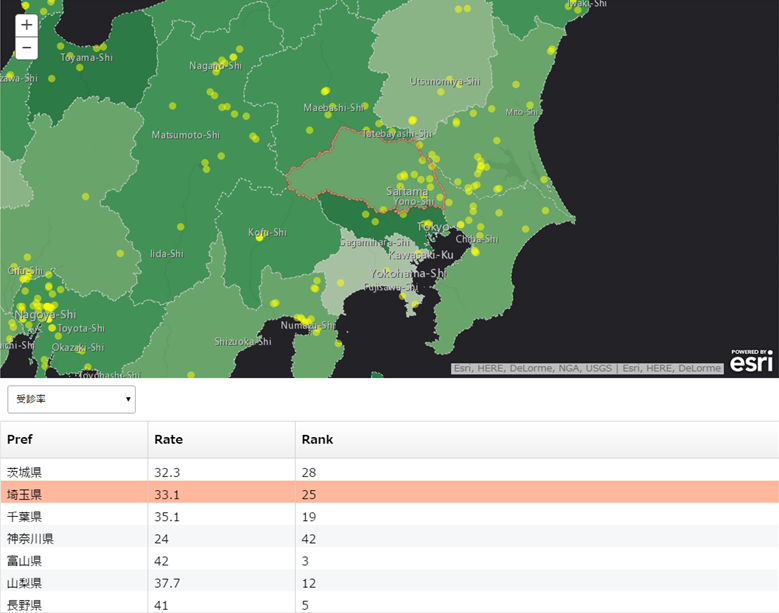

# esri-react-components-js

[ArcGIS API for JavaScript](https://developers.arcgis.com/javascript/) components built with [React](http://facebook.github.io/react/).

Get and Feel the capabilities of a virtual dom to use and visualize data on an interactive map.

[](http://badge.fury.io/bo/badges)

## Getting Started

### Install

```
bower install esri-react-components-js
```

### Configulation

Please change the `location` of `packages` if you would like to change the path of the dependent modules .

* examples/config/package.js

```javascript
  var dir_path = location.pathname.split("/").reverse().slice(3).reverse().join("/");

  var dojoConfig = {
    async: true,
    parseOnLoad: true,
    packages: [{
      name: 'react',
      location: dir_path + '/bower_components/react',
      main: 'react'
    }, {
      name: 'react-dom',
      location: dir_path + '/bower_components/react',
      main: 'react-dom'
    }, {
      name: 'fixedDataTable',
      location: dir_path + '/bower_components/fixed-data-table/dist',
      main: 'fixed-data-table'
    }, {
      name: 'reactWidgets',
      location: dir_path + '/src/esri-fixed-data-table/widget'
    }]
  };
```

## Components

* [__EsriFixedDataTable__](https://esrijapan.github.io/esri-react-components-js/examples/esri-fixed-data-table.html)



```javascript
var esriFixedDataTable = new EsriFixedDataTable({
  map: map, // esri.map or esri.arcgis.utils.createMap
  sources: [
    {
      layer: layer1, // esri.layers.FeatureLayer or esri.map.getLayer
      featureId: 'NAME', // ID Field
      attributes: [{ name: 'NAME', label: 'Name'}, { name: 'ADDRESS', label: 'Address'}, { name: 'TYPE', label: 'Type'}] // name: Field Name, label: Alias (using a header of table)
    },
    {
      layer: layer2,
      featureId: 'CITY_NAME',
      attributes: [{ name: 'CITY_NAME', label: 'City'}, { name: 'P_NUM', label: 'Population'}]
    }
  ],
  zoomLevel: 12 // Jumping to the level when selecting a row
}, 'tableDiv'); // <div> id of a table container
```

* [__EsriReactD3__](https://esrijapan.github.io/esri-react-components-js/examples/esri-react-d3-demo.html)


```javascript
var esriReactD3 = new EsriReactD3({
  map: map, // esri.map or esri.arcgis.utils.createMap
  chartType: 'BarChart', // 'BarChart' | 'PieChart' | 'AreaChart' | 'ScatterPlot' | 'LineChart'
  multipleSources: true // Chart views multiple data if true
  source: {
    layer: layer1, // esri.layers.FeatureLayer or esri.map.getLayer
    attributes: {
      x: { name: 'PREF', label: 'Pref' }, // Object when using single data
      y: [{ name: 'P_NUM_MALE', label: '男性人口' }, { name: 'P_NUM_FEMALE', label: '女性人口' }] // Array when using multiple data
    }
  },
  zoomLevel: 12 // Jumping to the level when selecting a data
}, 'chartDiv'); // <div> id of a chart container
```

## Dependencies

* [ArcGIS API for JavaScript](https://developers.arcgis.com/javascript/)
* [ArcGIS for Developers](https://developers.arcgis.com/en/)
* [React](https://facebook.github.io/react/)
* [Fixed Data Table](https://facebook.github.io/fixed-data-table/)
* [React D3 Components](https://github.com/codesuki/react-d3-components)
* [Babel](https://babeljs.io)

## Supported Browsers

* IE 9+
* Firefox
* Chrome
* Safari

## Resources

* [ArcGIS for Developers Resources (Japanese)](https://github.com/EsriJapan/arcgis-dev-resources)
* [GeoNet Japanese developers community site](https://geonet.esri.com/groups/devcom-jp)
* [ArcGIS API for JavaScript（Esri Japan)](http://www.esrij.com/products/arcgis-api-for-javascript/)
* [ArcGIS API for JavaScript (Esri)](https://developers.arcgis.com/javascript/jsapi/)

## Licensing
Copyright 2015 Esri Japan

Licensed under the Apache License, Version 2.0 (the "License");
you may not use this file except in compliance with the License.
You may obtain a copy of the License at

> http://www.apache.org/licenses/LICENSE-2.0

Unless required by applicable law or agreed to in writing, software
distributed under the License is distributed on an "AS IS" BASIS,
WITHOUT WARRANTIES OR CONDITIONS OF ANY KIND, either express or implied.
See the License for the specific language governing permissions and
limitations under the License.

A copy of the license is available in the repository's [LICENSE](./license.txt) file.
